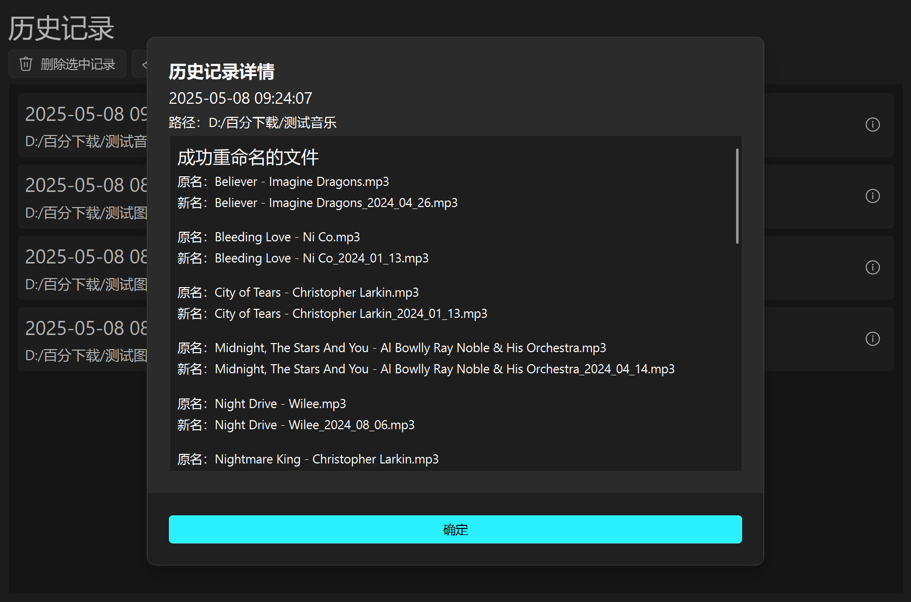

# 文件更名器

你还在为文件重命名而烦恼吗？为什么不试试这款“文件名更名器”？这款软件内置各种重命名规则类型，能够帮助你快速管理文件名。

## 特色功能

1. 根据已加载的规则批量修改文件夹内的文件名（和扩展名）
2. 内置多种重命名规则，用户能够根据规则模板自定义属于自己的规则

## 效果展览

## 已支持的规则类型

1. 交换文件名中指定分隔符前后的内容
2. 批量更改文件扩展名
3. 修改文件名中指定的字符串，支持正则表达式
4. 将文件名中的日期替换为指定日期，支持替换为重命名时的系统日期、文件创建日期、文件修改日期、文件访问日期和空日期（即删除日期）
5. 重命名为同一文件名并编号，可自定义起始编号和正整步长
6. 调整英文字母大小写

## 安装和使用

以下方法选择其一：

1. 使用git克隆该仓库，运行主文件夹内的main.py
2. 从Release下载已打包好的程序

## 使用的开源项目

GUI界面：[QFluentWidgets](https://github.com/zhiyiYo/PyQt-Fluent-Widgets)
